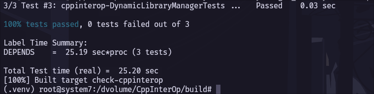

# env-setup
Fast automated setup procedure for development of [https://github.com/compiler-research/CppInterOp](CppInterOp).

## Setup

### Build Dockerfile
```bash
mkdir compiler-research
cd compiler-research
git clone <REPO URL> env-setup
./env-setup/clone.sh # clone repositories
docker build -t cppinterop:v1 env-setup # Build Docker image
```

### Build CppInterOp and dependencies
Run the container,
```bash
docker run -it cppinterop:v1 bash
```
Within the container,
```bash
cd dvolume
./env-setup/setup.sh 
```

## Test
```bash
cd compiler-research
source env-setup/env.sh
cd CppInterOp
# Run tests
cmake --build . --target check-cppinterop --parallel $(nproc --all)
```
You should see this after running the tests - 

